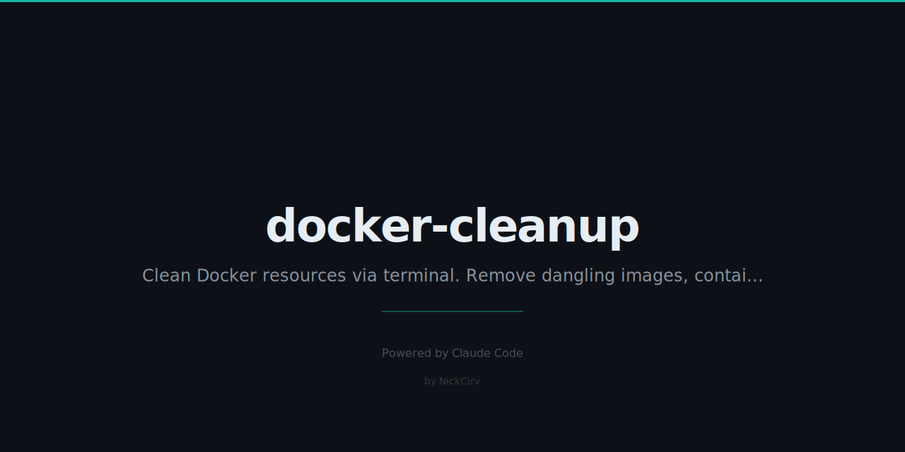

# docker-cleanup

> Interactive Docker cleanup. Select and delete dangling images, stopped containers, unused volumes, and networks. Zero npm dependencies.

## Install

```bash
# Run directly with npx (no install needed)
npx docker-cleanup

# Or install globally
npm install -g docker-cleanup
```

## Requirements

- Node.js 18+
- Docker CLI installed and daemon running

## Quick Start

```bash
dclean            # Interactive TUI (all resources)
dclean --images   # Only dangling/unused images
dclean --force    # Delete everything immediately (no prompts)
dclean --dry-run  # Preview what would be removed
```

## TUI Demo

```
  docker-cleanup v1.0.0  ·  Interactive Docker resource cleanup

  Disk usage:  images 2.34GB reclaim 1.1GB   containers 145MB reclaim 145MB

  Images (5) [2]    Containers (3)    Volumes (2)    Networks (1)

    ID             REPOSITORY:TAG                       SIZE      CREATED    STATUS
  ────────────────────────────────────────────────────────────────────────────────
    ▶ ●  a1b2c3d4e5f6   <none>:<none>                    245MB     3d ago     dangling
      ○  9f8e7d6c5b4a   node:18-alpine                   178MB     7d ago     unused
      ●  3c4d5e6f7a8b   python:3.11-slim                 129MB     14d ago    unused
      ○  1a2b3c4d5e6f   nginx:latest                     56MB      1mo ago    unused
      ○  7b8c9d0e1f2a   redis:7-alpine                   34MB      1mo ago    unused

  ────────────────────────────────────────────────────────────────────────────────
  ↑↓ navigate  Space select  a all  Tab category  Enter/d delete  q quit
  2 selected · ~374MB to free
```

## Options

| Flag | Description |
|------|-------------|
| `--images` | Only show dangling and unused images |
| `--containers` | Only show stopped/exited containers |
| `--volumes` | Only show unnamed/unused volumes |
| `--networks` | Only show unused custom networks |
| `--all` | Show all cleanup candidates (default) |
| `--force` | Non-interactive: delete all immediately |
| `--dry-run` | Preview deletions — nothing actually removed |
| `--format json` | Machine-readable JSON output |
| `-h, --help` | Show help |
| `-v, --version` | Show version |

## TUI Controls

| Key | Action |
|-----|--------|
| `↑` / `↓` | Navigate items |
| `Tab` | Switch category |
| `Space` | Toggle selection |
| `a` | Select / deselect all in current category |
| `Enter` / `d` | Delete selected (asks for confirmation) |
| `q` / `Ctrl+C` | Quit |

## What Gets Shown

**Images** — dangling images (`<none>:<none>`) and images not used by any container. Shows: ID, repo:tag, size, age, status.

**Containers** — exited, dead, and created (never-started) containers. Shows: ID, name, image, status, age.

**Volumes** — dangling volumes (not mounted by any container). Shows: name, driver, mountpoint.

**Networks** — custom networks not in use by any container (built-in bridge/host/none excluded). Shows: ID, name, driver, age.

## Why?

`docker system prune` is a blunt instrument — it deletes everything without letting you see or choose. `docker-cleanup` gives you a full view of what's taking up space and lets you select exactly what to remove.

- See everything at a glance before deleting anything
- Cherry-pick specific images or containers
- Know how much space you're freeing before you commit
- Safe: never touches running containers or active volumes

## Security

- Uses `execFileSync` / `spawnSync` with args as arrays — no shell injection
- Zero npm dependencies — no supply chain risk
- No network calls, no telemetry, no analytics

## License

MIT

---

Built with Node.js · Zero npm deps · MIT License
